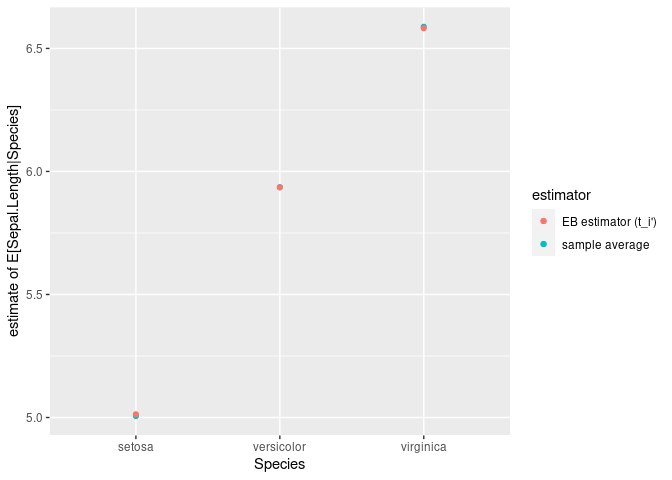
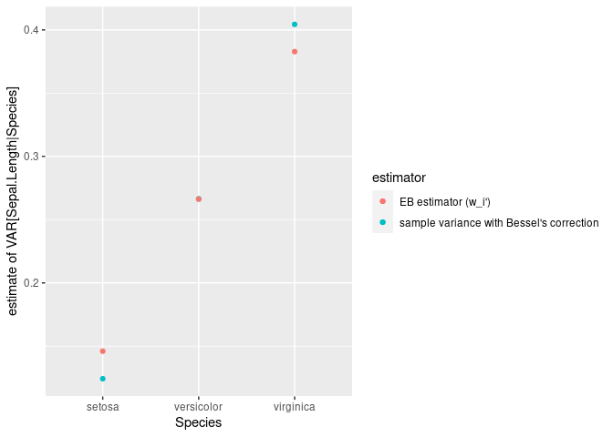

<!-- README.md is generated from README.Rmd. Please edit that file -->

# robbins1985 – Linear empirical Bayes estimation of means and variances

<!-- badges: start -->

[](https://github.com/jan-glx/robbins1985/actions)
[](https://lifecycle.r-lib.org/articles/stages.html#experimental)
<!-- badges: end -->

`robbins1985` implements the non-parametric and linear empirical Bayes
estimator of means variances proposed by [Robbins
(1985)](https://doi.org/10.1073/pnas.82.6.1571). `robbins1985` provides
a single function: `estimate` that calculates the proposed estimators as
well as the statics used for their calculation.

## Installation

You can install the development version of `robbins1985` like so:

``` r
remotes::install_github("jan-glx/robbins1985")
```

## Example

Although not ideal (only 3 populations), the `iris` data set can be used
to demonstrate the usage and the effect of the estimators:

``` r
library(ggplot2)
res_df <- robbins1985::estimate(x_ij = split(iris$Sepal.Length, f = iris$Species))
res_df$Species <- rownames(res_df)

ggplot(res_df, aes(x=Species)) +
  geom_point(aes(y=x_i, color = "sample average")) +
  geom_point(aes(y=t_i, color = "EB estimator (t_i')")) +
  labs(y = "estimate of E[Sepal.Length|Species]", color = "estimator")
```



``` r

ggplot(res_df, aes(x=Species)) +
  geom_point(aes(y=s2_i, color = "sample variance with Bessel's correction")) +
  geom_point(aes(y=w_i, color = "EB estimator (w_i')")) +
  labs(y = "estimate of VAR[Sepal.Length|Species]", color = "estimator")
```

 Note how the
empirical Bayes estimator shrinks the estimates towards the average of
the unbiased population means. The effect is more pronounced for the
variance estimate, where this *might* be useful to improve tests for the
difference in means by providing an intermediate between pooled and
independent variance estimates …
